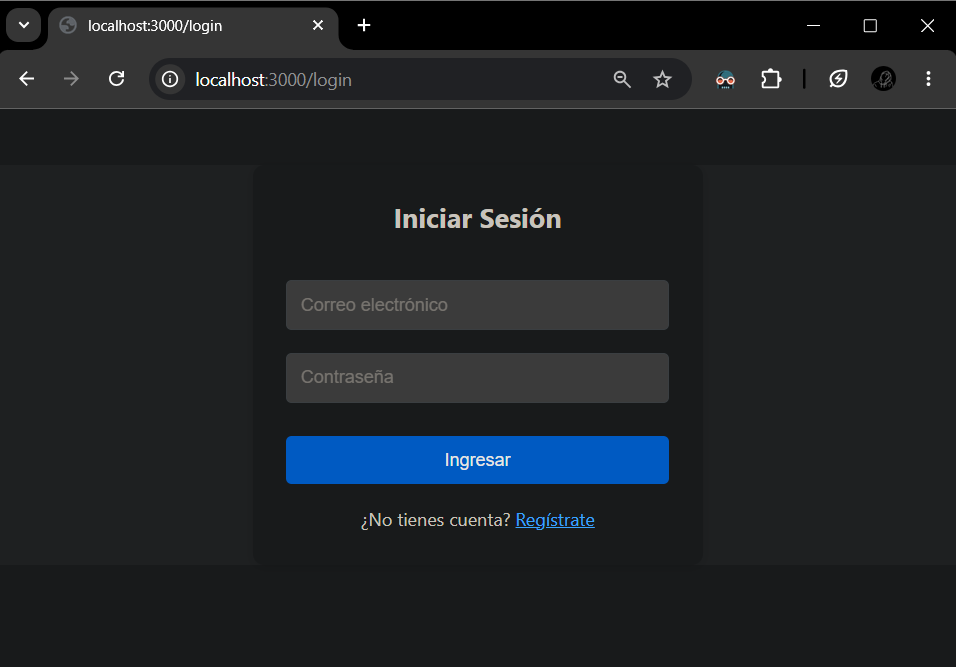
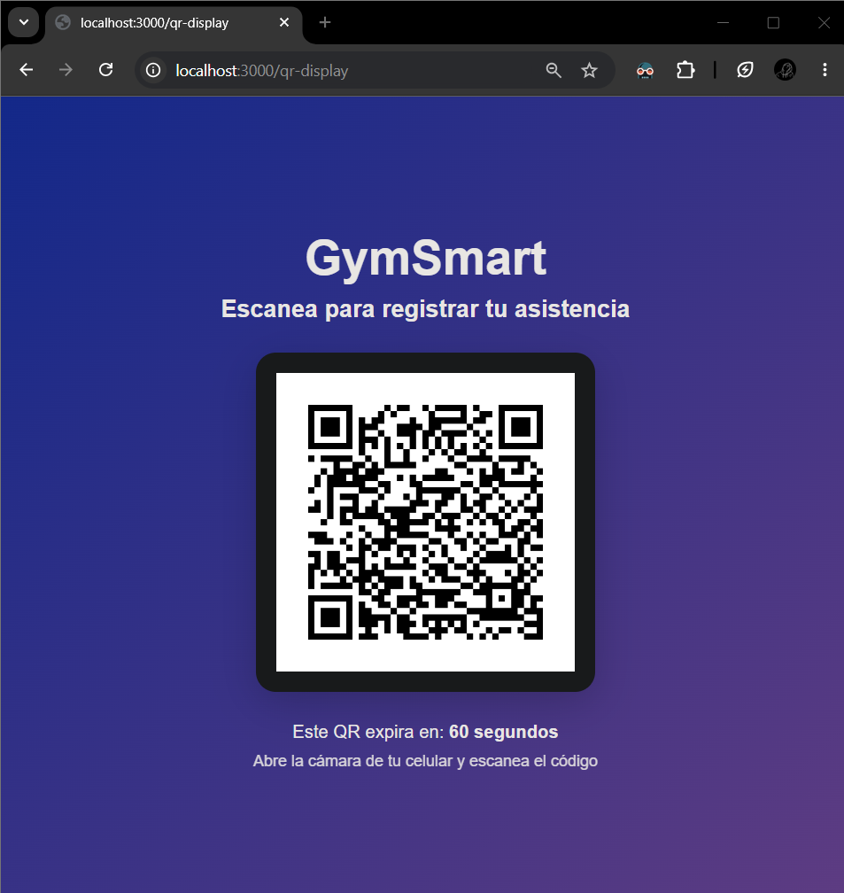
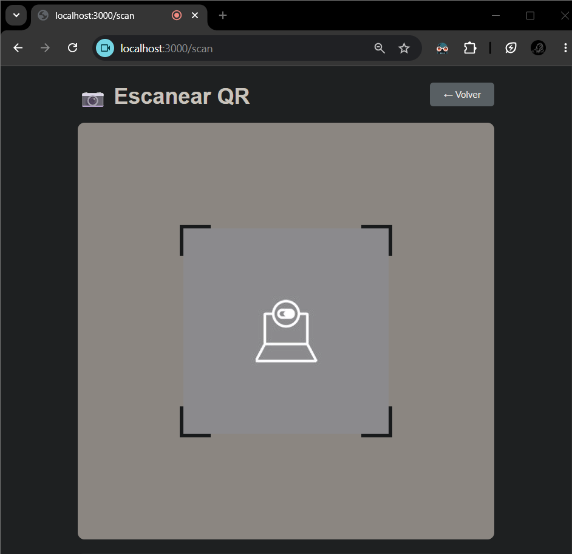

# GymSmart

SISTEMA WEB CON MACHINE LEARNING PARA ASISTENCIA MEDIANTE QR Y GESTIÓN DE MEMBRESÍAS

# Tecnologias

- Frontend: Next.js
- Backend: FastAPI
- Base de datos: Supabase PostgreSQL
- Autenticación: JWT + Supabase
- QR dinámico: HMAC + expiración
- ML: pendiente
- Automatización: pendiente

# Arquitectura

Usuario → Frontend Next.js → FastAPI → Supabase

# Estado actual del proyecto

## Módulos completados
- Autenticación
- Gestión de membresías
- Sistema QR dinámico
- Registro de asistencia

### Módulos pendientes
- Panel administrativo
- Control de empleados
- Machine Learning
- Automatización n8n

# Capturas del sistema

## Login

---

## Dashboard administrativo

---

## Gestión de planes

---

## Registro de nuevo plan

---

## Generación de QR

---

## Escaneo QR

---

## Registro de usuarios

---
